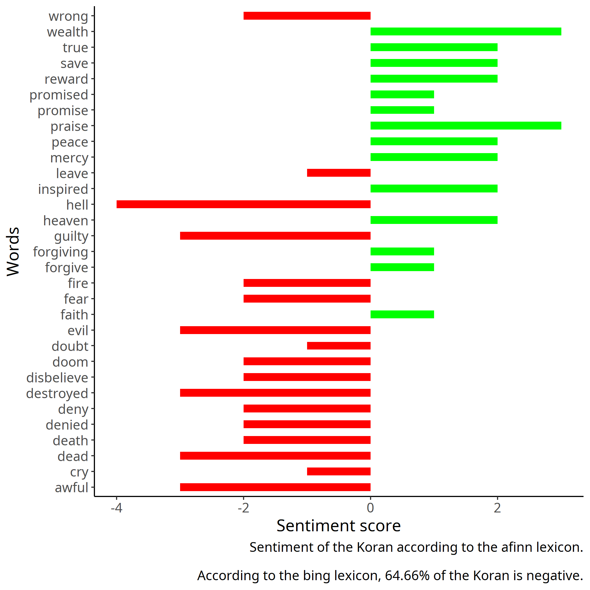
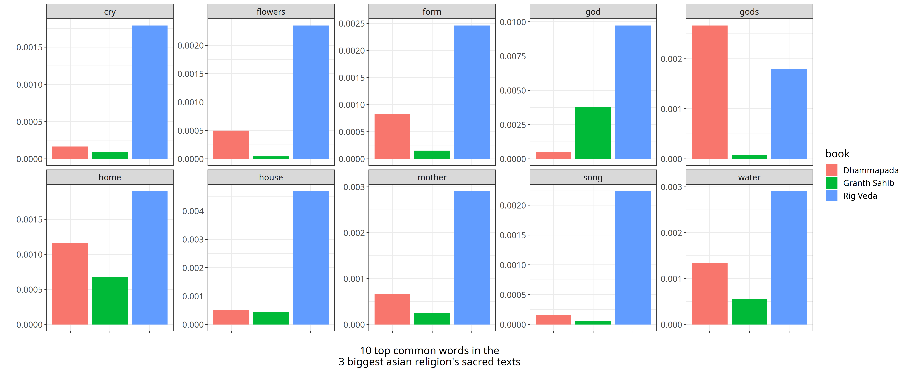
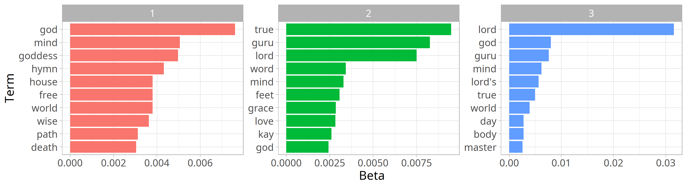

```{r setup, include=FALSE}
knitr::opts_chunk$set(echo = TRUE)
```


```{r libraries, include=FALSE}
library(png)
library(knitr)
library(ggplot2)
```

## Aimed at curiosity

The goal of this project is to learn more about the **6 main religions in the world**

And maybe find some principles and values that can lead to a better living.

My analysis focuses on the sacred texts of 6 religions:

* Christianity
* Judaism
* Islam
* Hinduism
* Buddhism
* Sikhism<br><br>
These are thought to be the religions with the highest number of followers.

## Data

The sacred texts of these religions are called:

* The Holy Bible (Judaism and Christianity)<br>
  &emsp;I split the Holy Bible in Old Testament and New Testament, 
  &emsp;each one referred to Judaism and Christianity
* The Koran (Islam)
* The Rig Veda (Hinduism)
* The Dhammapada (Buddhism)
* The Shri Guru Granth Sahib Ji (Sikhism)<br>
  &emsp;Also called Adi Granth or Granth Sahib

## Sentiment Analysis

* How is the main sentiment of the sacred texts of these religions?

* Which sacred texts have the most positive and the most negative sentiment?

* Is there a relationship between the sentiment of the sacred text and the number of followers of a religion?

* Does the sentiment of the sacred text of a religion reflect the wellness of a state where the religion is popular?

## Sentiment Analysis


### ***Sentiment of the Old Testament***

<div>
{width=90%, height=90%}
</div>

<br>

### ***Sentiment of the New Testament***

<div>
{width=90%, height=90%}
</div>

<br>

### ***Sentiment of the Koran***

<div>
{width=90%, height=90%}
</div>

<br>

### ***Sentiment of the Rig Veda***

<div>
{width=90%, height=90%}
</div>

<br>

### ***Sentiment of the Dhammapada***

<div>
{width=90%, height=90%}
</div>

<br>

### ***Sentiment of the Granth Sahib***

<div>
{width=90%, height=90%}
</div>

## Sentiment Analysis

> All the texts related to monotheist religions have a negative sentiment percentage of around 65%, so they are mostly negative
  But the Gospels and the Granth sahib showed similar plots, where the few positive words occur most of the time.
  
> Rig Veda and Dhammapada showed some balance between negative and positive sentiment, the curious fact is that one of the principles and values of these 2 religions is the search for inner balance.

> Sacred texts of religions that are somehow related show similar sentiments.

## Sentiment Analysis

Let's give some answers now:

* Sacred texts of monotheist religions show a mostly negative sentiment (Bible, Gospel, Koran and Granth Sahib) <br>
  Rig Veda and Dhammapada show a more balanced sentiment.
* The most positive text is the Rig Veda, the sacred text of Hinduism.
* There is no relation between the sentiment of a sacred text and the number of followers of the religion, there are billions of followers for religions where the sacred text has either a positive or negative sentiment.

## Sentiment Analysis

And for the last question...

<div>
{width=105%, height=105%}
</div>

## Term and Document Frequency

* Which are the most frequent words among the sacred texts?
* Do sacred texts of different religions have words in common?
* If so, could it be due to common origins between the religions? Maybe the geographical position?

## Term and Document Frequency

### **Bible, Gospel and Koran**

*Term Frequency Distribution*

<div>
{width=105%, height=105%}
</div

>It looks like Zipf's law hits here.

<br>
<br>

*Term Frequency vs Rank*

<div>
{width=105%, height=105%}
</div>

<br>
<br>

*tf-idf*
 
 <div>
{width=105%, height=105%}
</div>

<br>
<br>

*Main Common Words Frequency in Each Book*

<div>
{width=107%, height=107%}
</div>
 <br>

## Term and Document Frequency

### **Rig Veda, Dhammapada, Granth Sahib**

*Term Frequency Distribution*

<div>
{width=105%, height=105%}
</div

>It looks like Zipf's law hits here.

<br>
<br>

*Term Frequency vs Rank*

<div>
{width=105%, height=105%}
</div>

<br>
<br>

*tf-idf*
 
 <div>
{width=105%, height=105%}
</div>

<br>
<br>

*Main Common Words Frequency in Each Book*

<div>
{width=107%, height=107%}
</div>
 <br>

## Term and Document Frequency

### **Bible, Gospel, Granth Sahib and Koran**

Relatively to the 4 monotheist religions.

*Term Frequency Distribution*

<div>
{width=105%, height=105%}
</div

>It looks like Zipf's law hits here.

<br>
<br>

*Term Frequency vs Rank*

<div>
{width=105%, height=105%}
</div>
<br>
tf-idf and Common Words Analysis between these 4 texts didn't show anything interesting.

## Term and Document Frequency

> Zipf's law exists even in these ancient books, but maybe this is because of the various translations over the centuries

> Bible, Gospels and Koran show little wimilar words <br>
  Rig Veda, Dhammapada and Granth Sahib show no significant similarities after all

> The Bible shows a lot of referencies to the history of the Jewish people, this means that the Judaism is strongly linked to the Jewish people and culture. <br>
  the Gospels instead have a lot of general words and doesn't stick to one ethnicity only, this shows that Christianity is suitable for any ethnicity or culture

> The Koran has the word "Allah" being used a lot more than the word "God" in the other texts, that means Islam is a religion where the god is the most important thing, even more than the prophets or the stories.

> Granth Sahib word frequency distribution is similar to the other 3 monotheistic religions, but the common words are not interesting at all.

## Term and Document Frequency

Let's give some answers now:

* The word "God" is obviously the one that comes most of the time in each sacred text.
* There are not many interesting common words among the sacred texts, only between Bible, Gospel and Koran there are some. <br>
  But the Granth Sahib shows a very similar word frequency distribution to the ones I mentioned.
* The similarities between Bible, Gospels and Koran could be due to the geographical closeness of the cradle of each religion, and many cultural similarities.

## Topic Modeling

* Which are the main topics among these books? <br>
  Which words describe them?
* Are there common topics between different religions? <br>
  Do they use the same words to describe them?
* If so, does this support my previous suppositions?

## Topic Modeling

### **Bible, Gospel, and Koran**

*Word-topic probabilities*

<div>
{width=100%, height=100%}
</div>

<br>
<br>

### **Bible and Gospel**

*Word-topic probabilities*

<div>
{width=100%, height=100%}
</div>

<br>
<br>

*Beta-Spread with log Ratio*

<div>
{width=90%%, height=90%}
</div>

## Topic Modeling

### **Rig Veda, Dhammapada and Granth Sahib**

*Word-topic probabilities*

<div>
{width=100%, height=100%}
</div>

<br>
<br>

### **Rig Veda and Dhammapada**

*Word-topic probabilities*

<div>
{width=100%, height=100%}
</div>

## Topic Modeling

### **Bible, Gospel, Koran and Granth Sahib**

*Word-topic probabilities*

<div>
{width=107%, height=107%}
</div>

## Topic Modeling

> Sacred texts of religions where one is a detachment from the other, show many similarities abd differencies:<br>
  The Bible and the Gospels come both from a Jewish origin, and the two texts show a lot of similar topics, but the first is somehow tied to the Jewish culture and history, and the second only talks about the life of Jesus Christ, so it's more suitable for other cultures and ethnicities. <br>
  Rig Veda and Dhammapada, come both from an Hindu origin, but the second one got detached to promote an anthropocentric philosophy, going against the concept of "divine", the two texts show many common topics but also differencies.

> Christianity is the religion with the highest number of followers in the world, and my analysis suggested that the New Testament is a book which is suitable for any culture or ethnicity.

## Term and Document Frequency

Let's give some answers now:

* "God" is the main topic among all the sacred texts, as we could imagine. <br>
  The history of Jesus Christ is the main topic of the Gospels, the history of the Jewish people is the main topic of the Bible, the Granth Sahib contains many referencies to the war and to the guns, I could only comprehend this while reading what the "Five Kay's" are, the Rig Veda is about many gods and natural elements that I think are related to the gods.
* There are many common topics among the sacred texts of different religions, in particular for the Gospels, that has the most common topics with the other texts, and this shows another time that Christianity is universal.

## Final Comments

* Christianity seems to be a universal religion, the New Testament showed the most similarity with the other texts, and this religion is the most followed around the world, it adapts to different cultures and ethnies.

* On the other side, the Bible seems to be connected to the Jewish history, making the Judaism a religion which isn't suitable for other ethnies.

* Rig Veda and Dhammapada are the most balanced books when it gets to sentiment, the curious part of it is that one of the principles of these two religions is the "search for inner balance".

* Zipf's law exists even in these ancient books, but I think this is due to the many translations that were done during the centuries.

* Sacred texts of religions like Christianity and Judaism, or Buddhism and Hinduism, that are a detachment from one-another, seem to show some similarities, even if they profess very different creeds.

## The End {data-background=the_fallen_angel.jpg data-background-size=cover}

